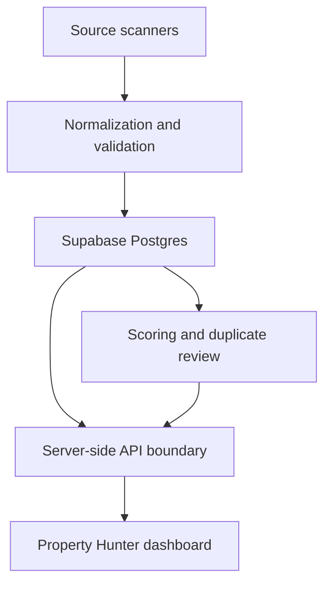

# Montenegro Property Hunter

An acquisition-intelligence dashboard for discovering, comparing and tracking apartments for sale in Bar, Montenegro.

The system turns fragmented marketplace advertisements into a reviewable property pipeline: it normalizes listings, records price history, identifies likely cross-agency duplicates, scores opportunities and supports follow-up work from one interface.

> This public edition uses synthetic preview data and contains no production credentials, private CRM notes, browser sessions or advertiser contact details.

## Production results

By September 2026, the private production system had:

- integrated eight property sources, including an authenticated Estitor workflow;
- indexed 1,767 in-scope and historical listings;
- stored 4,106 time-stamped observations;
- generated 809 duplicate-review candidates;
- processed an 83-page Estitor scan containing 1,583 records, importing 1,256 Bar listings after scope validation; and
- preserved source records and human decisions without automatically merging or deleting advertisements.

## What it does

- Multi-source listing ingestion and normalization
- Historical observations and price-change detection
- €/m² calculation, anomaly flags and opportunity scoring
- Cross-source duplicate grouping with explainable evidence
- Photo galleries and targeted photo-enrichment queues
- Saved searches with daily or weekly digest views
- Natural-language filter parsing with visible interpreted criteria
- CRM stages, notes, follow-ups, viewings and negotiation tracking
- Data-quality and scanner-health control centers
- CSV export for filtered research

## Architecture



The browser never receives a Supabase service-role credential. Dashboard requests pass through server-side application routes and a protected Edge Function. The public repository replaces production-only values with documented environment variables.

See [Architecture](docs/ARCHITECTURE.md) for the data flow and safety model.

## Technology

- TypeScript, React and Next.js-compatible Vinext
- Cloudflare Workers runtime
- Supabase Postgres and Edge Functions
- SQL migrations and scheduled duplicate processing
- Responsive dashboard UI with server-side data access

## Run the synthetic demo

Requirements: Node.js 22.13 or newer.

```bash
npm ci
npm run dev
```

Without environment variables, the application loads synthetic preview records. To connect a private deployment, copy `.env.example` to `.env.local` and provide server-only values. Never use `NEXT_PUBLIC_` for the API token or Supabase service key.

## Verification

```bash
npm test
npm run lint
```

## Project history

The repository preserves the genuine feature milestones from the original development timeline. The implementation commits were generated through Codex/Sites under Dario Omerdić's product direction, source research, acceptance testing and deployment decisions. See [Project journey](docs/PROJECT-JOURNEY.md) for the dated milestones and engineering decisions.

## Security and privacy

- Production credentials and hosting identifiers are excluded.
- Preview listings are synthetic.
- HAR files, cookies, browser profiles, scan exports and database dumps are ignored.
- Production data and CRM notes are not part of this repository.
- A public live demo is intentionally deferred until authentication and authorization hardening is complete.

Please report security issues according to [SECURITY.md](SECURITY.md).

## License

MIT — see [LICENSE](LICENSE).
